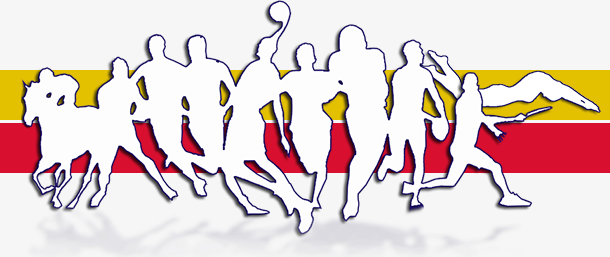

####################
Regolamento delle attività sportive del comune di Palermo e regolamento della Piscina e dello Stadio delle Palme
####################

.. figure:: img/palermo.PNG

Fonte :
   `Regolamento delle attività sportive del comune di Palermo <https://www.comune.palermo.it/js/server/normative/_24122012094324.pdf>`_
   
   `Regolamento della Piscina del comune di Palermo <https://www.comune.palermo.it/js/server/normative/_24122012094325.pdf>`_
   
   `Regolamento dello Stadio delle Palme del comune di Palermo <https://www.comune.palermo.it/js/server/normative/_24122012094323.pdf>`_.

    `Portale dello sport <http://sport.comune.palermo.it>`_

**Informazioni ulteriori**                                                                                                   
   `Carta dei Servizi comunali di Palermo <https://www.comune.palermo.it/amministrazione_trasparente.php?sel=16&asel=72>`_ 

.. figure:: img/ccbysa.png

Quest'opera è distribuita con `Licenza CC BY SA 4.0 <https://creativecommons.org/licenses/by-sa/4.0/deed.it>`_ - Creative Commons,  Attribuzione, Condividi allo stesso modo, versione 4.0 Internazionale.

|

Testo dei Regolamenti
==========================

.. toctree::

   _docs/introduzione1.rst
   _docs/titolo1-2.rst
   _docs/titolo2.3.rst
   _docs/titolo3-4.rst
   _docs/titolo4-5.rst
   _docs/titolo5-6.rst
   _docs/piscina.rst
   _docs/stadiopalme.rst
